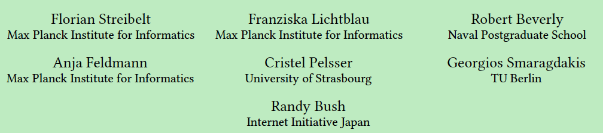

## 2019.5.13
#### 1. DeepDecision: A Mobile Deep Learning Framework for Edge Video Analytics.
>infocom 2018
1. augment reality (AR) devices, video
2. on smart-phones, AR applications
> 作者: 
> 加州大学, Riverside (Xukan Ran, Haolianz Chen)
> College of William and Marray (Xiaodan Zhu)
#### 2. A Computing Plateform for Video Crowdprocessing Using Deep Learning
>infocom 2018
1. optimize the performance on mobile devices with computational offload ...
> 作者：
> 北京大学 (Zongqing Lu)
> Army Research Lab (Kevin S.Chan)
> 宾州州立大学 (Thomas La Porta)

#### 3. Inferring Persistent Interdomain Congestion
>sigcomm 2018
读不懂？ 可读性差

#### 4. When the Dike Breaks: Dissecting DNS Defenses During DDoS (extended)
>IMC 2018
1. Dissect 剖析
> 作者：
> SIDN Labs and TU Delft (Giovance C.M. Moura)
> John Hiedemann (USC/Information Sciences Institute)
> SIDN Labs and University of Twente (Moritz Muller)

## 2019.5.14
#### 5. Three Bits Suffice: Explicit Support for Passive Measurement of Internet Latency in QUIC and TCP
> IMC 2018
1. 只需要3个bit，能测量包括TCP和QUIC在内的网络延迟
> 作者：
> ETH Zurich (Piet De Vaere, Tobias Buhler, Mirja Kuhlewind, Brian Trammell)

#### 6. Multilevel MDA-Lite Paris Traceroute
> IMC 2018

>作者：
> 法国索邦大学(Kevin Vermeulen)
> RIPE NCC (Stephen D.Strowes)
> 翻过索邦大学 Sorbonne(Olivier Fourmaux, Timur Friedman)
1. 问题：传统的Paris Traceroute and MDA (mutipath detection algorithm) 需要在trace的路径上传输大量的数据包，不适用于部署到除了Paris Traceroute 以外的平台上。
2. tracerotue 常被用来做故障排除troubleshoot, 长期的日常调查
3. 提出了能够减少开销同时保持低失败率的traceroute tool
4. Fakeroute, simulator
5. investigate the difference between 直接和简介probing for alias resolution
6. 目前工作主要考虑的是Ipv4的情况，未来考虑ipv6的情况

#### 7. Cloud Datacenter SDN Monitoring: Experiences and Challenges
>IMC 2018

>作者：
> 加州大学圣地亚哥分校(Arjun Roy, Deepak Bansal, David Brumley, Harish Kumar Chandrappa )

1. 问题：大部分工作研究：管理在数据中心物理设备产生的故障， 很少在logical overlay network的管理上(提供不同租户之间的强隔离=logical overlay network)
2. 描述了在建立一个cloud-based fault monitoring systems 的挑战，描述了 virtualization 是如何影响多租户数据中的故障管理的
3. 详细描述了会出现的一些问题

#### 8. A Case for Web Service Bandwidth Reduction on Mobile Devices with Edge-Hosted Personal Services
>infocomm 2018
>作者：
> SUNY Binghamton 美国纽约州内排名最高的大学
1. 一些web services中重复内容，headers多，small payload
2. 在保证运营商和用户的利益下，提出新的在边缘节点的专为单个用户提供不同服务的方法。并研究了部署。。。

## 2019.5.15
#### 9. Adaptive VNF Scaling and Flow Routing with Proactive Demand Prediction
>infocomm 2018
>作者:
>华中科技大学(Xincai Fei, Fangming Liu)
>NetX Lab 香港(Hong Xu)

## 2019.5.20
#### 10. Quality of Experience-based Routing of Video Traffic for Overlay and ISP Networks

>infocomm 2018
>作者:
>Universite Cote d’Azur(蔚蓝海岸大学) (Giacomo Calvigioni, Ramon Aparicio-Pardo, Lucile Sassatelli)
>华为法国研究所(Jeremie Leguay, Paolo Medagliani, Stefano Paris)

#### 11. Towards Stability Analysis of Data Transport Mechanisms: aFluid Model and an Application
>infocomm 2018
>作者：
>University of Massachusetts, Amherst(Gayane Vardoyan, C.V. Hollot, Don Towsley)

#### 12. PoiRoot: investigating the root cause of interdomain path changes
>sigcom 2013
>作者：

TODO

## 2019.6.2
#### 1. BGP Communities: Even more Worms in the Routing Can

快捷方式是：control + command + v 粘贴图片

## 2019.6.5
icc-2018
#### 1. Prompt Lightweight VPN Session Resumption for Rapid Client Mobility and MTD Enablement for VPN Servers
resumption 恢复

#### 2. eyeDNS: Monitoring a University Campus Network

## 2019.6.10
icc-2018
#### 1. Enhanced Session Table Architecture for Stateful Firewalls
stateful firewalls:提供数据包状态检查的防火墙

## 2019.6.11
icc-2018
#### 1. Monsieur Poirot: Detecting Botnets Using Re-Identification Algorithm and Nontrivial Feature Selection Technique
botnets: 主机网络， a botnet is a group of compromised hosts(bots) that are remotely commanded by an attacker through a command and control channel.
problem: modern botnets are migrating to P2P network
>作者

通过network flow 检测botnets， 特征分析，detect malicious traffic
Monsieur Poirot -detect other botnets

#### 2. Modeling Malware as a Language
malware: 恶意软件
恶意软件的检测， modeling malware as a language for the purpose of performing such semantic-based analysis
>作者

#### 3. A Dynamic Rate Adaptation Scheme for M2M Communications
M2M: machine-to-machine, IoT tech.

>作者

备注：没有过多了解

#### 4. Assessing Coverage and Throughput for D2D Communication
D2D: device to device, 不经过中间网络，直接通信，用途广泛，比如车与车之间，碰撞，距离等

提出了一个测量D2D coverage probability and average throughput 以及其他参数性能的 framework
why do this measurement?
> 句子：our contributions are three-fold

D2D通信指的是UE 不经过基站直接通信，M2M不仅包括UE还包括各种Machine之间的通信

> D2D refers to mobile devices like smart phones directly communicating with each other. M2M is a rather more generic term used for variety of device communicating with each other or through a network.
M2M refers to a communication paradigm that enable machines (objects) to communicate with each other with little or no human interaction
> 作者：

#### 5. An Optimized and Secure Authentication Scheme for Vehicular Ad Hoc Networks
Vehicular Ad Hoc Networks(VANETs)
验证方面，可读可不读
>author:

#### 6. Who Am I? Personality Detection Based on Deep Learning for Texts.
论文主题很有趣，作为趣闻来读
提出the structure of the texts online 对于性格的推测也很重要

#### 7. Urban Traffic Bottleneck Identification Based on Congestion Propagation
交通traffic， 定义了uraban traffic bottleneck， most significance(road segments that will lead more congestion cost in urban area, 然后提出了identification method)
Introduction 写得好
>author:

